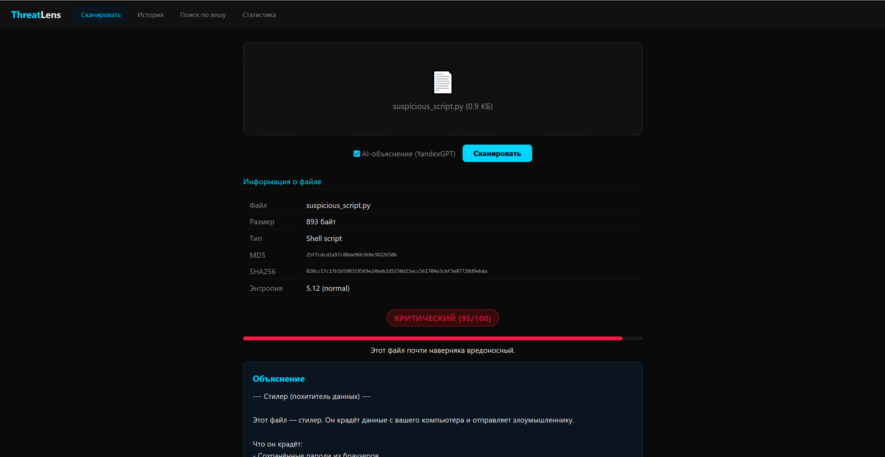
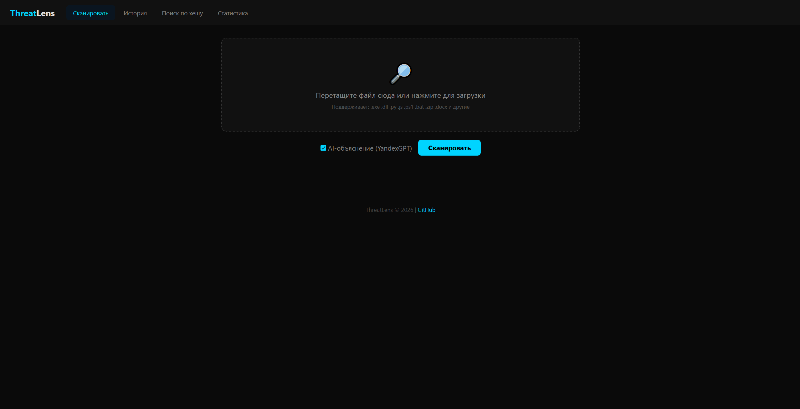
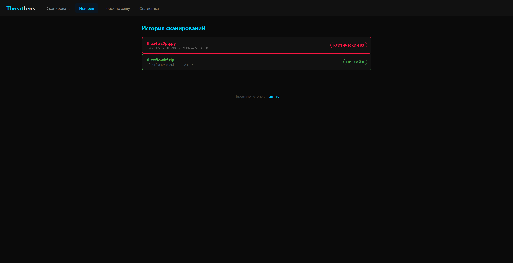

<p align="center">
  <h1 align="center">ThreatLens</h1>
  <p align="center">
    <strong>AI-Powered File Threat Analyzer</strong>
  </p>
  <p align="center">
    Upload any file. Get a clear explanation of what it does and why it's dangerous.
  </p>
  <p align="center">
    <a href="https://cozy-spontaneity-production-1a38.up.railway.app">Live Demo</a> &bull;
    <a href="#quick-start">Quick Start</a> &bull;
    <a href="#features">Features</a> &bull;
    <a href="#how-it-works">How It Works</a>
  </p>
</p>

---

Unlike traditional antivirus that says "Trojan.Generic", ThreatLens **explains** threats in human language. It tells you exactly what a suspicious file does, which data it targets, and what you should do about it.

> **Try it now:** [https://cozy-spontaneity-production-1a38.up.railway.app](https://cozy-spontaneity-production-1a38.up.railway.app)

## Screenshots

<p align="center">
  
  <br><em>File analysis with threat explanation in human language</em>
</p>

<p align="center">
  
  <br><em>Simple drag & drop file upload</em>
</p>

<p align="center">
  
  <br><em>Scan history with risk indicators</em>
</p>

## Features

- **Static Analysis** --- PE imports, strings, entropy, packer detection
- **Script Analysis** --- Python, JavaScript, PowerShell, Batch, VBScript
- **Office Analysis** --- VBA macros, OLE objects, DDE attacks
- **Archive Analysis** --- ZIP, RAR, 7z, tar.gz --- recursive scan, shows which file inside is dangerous
- **GitHub Repo Scan** --- Scan any public repository for malicious code
- **1500+ YARA Rules** --- Community rules + custom ThreatLens rules
- **Heuristic Engine** --- Behavioral analysis detects unknown threats (stealer, RAT, ransomware, miner, dropper, keylogger)
- **AI Explanations** --- Built-in (no API needed) + optional YandexGPT
- **Threat Scoring** --- LOW / MEDIUM / HIGH / CRITICAL
- **SHA256 Cache** --- Instant results for previously scanned files
- **Web UI** --- Upload files via browser, search by hash, scan history
- **Docker** --- `docker-compose up` and everything works

## How It Works

```
File Upload (Web / CLI)
        |
        v
+-------------------+
| Static Analysis   |  PE imports, strings, entropy, YARA
+--------+----------+
         |
         v
+-------------------+
| Heuristic Engine  |  Behavioral pattern matching (6 threat profiles)
+--------+----------+
         |
         v
+-------------------+
| AI Explanation    |  Human-readable threat description (RU/EN)
+--------+----------+
         |
         v
    Risk Report
    + Recommendations
```

## Quick Start

### Web UI (easiest)

```bash
git clone https://github.com/MaximkaVLG/threatlens.git
cd threatlens
pip install ".[all]"
python -m threatlens.web.app
# Open http://localhost:8888
```

### CLI

```bash
# Scan a file
threatlens scan suspicious.exe

# Scan an archive (shows which file inside is dangerous)
threatlens scan cheat_pack.zip

# Scan a GitHub repository
threatlens repo https://github.com/user/suspicious-project

# Look up by SHA256 hash
threatlens lookup abc123def456...

# Show scan statistics
threatlens stats
```

### Docker

```bash
docker-compose up
# Open http://localhost:8888
```

## What It Detects

| Category | Examples |
|----------|----------|
| **Password Theft** | Chrome/Firefox/Edge passwords, cookies, Discord tokens, Telegram sessions |
| **Code Injection** | CreateRemoteThread, WriteProcessMemory, reverse shells |
| **Keyloggers** | GetAsyncKeyState, pynput, screen capture |
| **Network Activity** | C2 communication, payload download, data exfiltration |
| **Persistence** | Registry autorun, scheduled tasks, startup folder |
| **Obfuscation** | Base64/eval/exec chains, packed binaries, UPX/Themida/VMProtect |
| **Data Exfiltration** | Telegram bots, Discord webhooks, email, FTP |
| **Crypto/Ransomware** | Miners (XMRig), wallet stealers, file encryptors |
| **Office Macros** | Auto-executing VBA, shell execution, DDE attacks |

## Heuristic Engine

Unlike YARA (exact pattern matching), the heuristic engine evaluates **combinations of behaviors**:

| Threat Type | Key Behaviors | Example |
|-------------|--------------|---------|
| **Stealer** | Browser data access + exfiltration channel | Chrome passwords -> Telegram bot |
| **RAT** | Injection + network + persistence | Reverse shell + registry autorun |
| **Ransomware** | Crypto operations + file access + ransom note | AES encrypt + "YOUR_FILES" |
| **Miner** | Mining keywords + persistence | stratum+tcp + hashrate |
| **Dropper** | Download + execute + obfuscation | URLDownload + eval(base64) |
| **Keylogger** | Keyboard hooks + exfiltration | GetAsyncKeyState + screenshot |

Calibrated on 12 test samples --- 100% accuracy, 0% false positives on clean files.

## API

```bash
# Scan a file
curl -X POST http://localhost:8888/api/scan -F "file=@suspicious.exe"

# Look up by SHA256
curl http://localhost:8888/api/lookup/abc123...

# Scan history
curl http://localhost:8888/api/history

# Statistics
curl http://localhost:8888/api/stats
```

## Performance

| File Size | Scan Time |
|-----------|-----------|
| 1 KB | 0.01s |
| 1 MB | 0.1s |
| 5 MB | 0.5s |
| 18 MB | ~1s |

9x cache speedup on repeated scans.

## Tech Stack

- Python 3.10+
- pefile, yara-python, oletools --- static analysis
- py7zr, rarfile --- archive support
- FastAPI + uvicorn --- Web UI
- SQLite --- result cache
- rich --- CLI formatting
- Docker --- containerized deployment

## License

MIT License --- see [LICENSE](LICENSE) for details.
