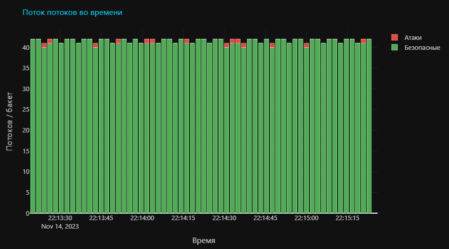
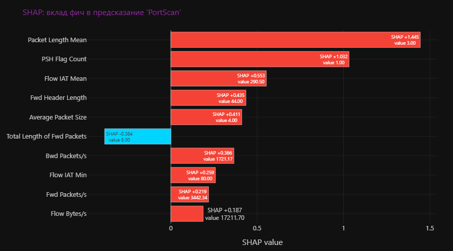
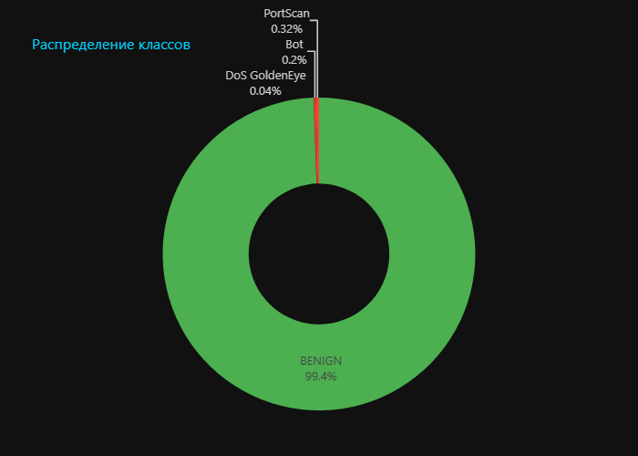
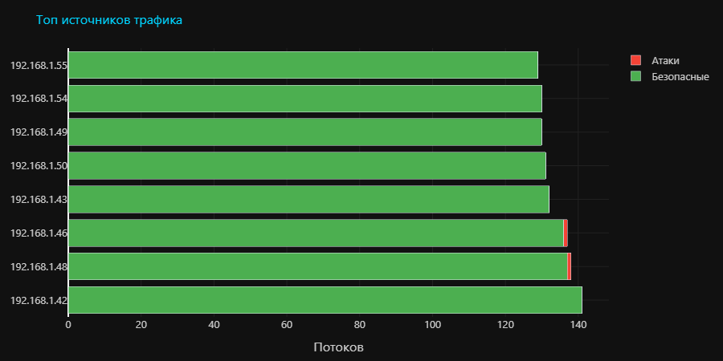
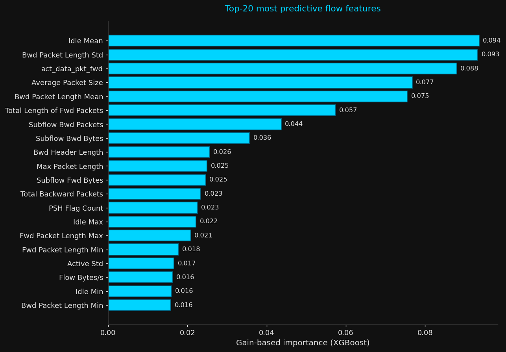
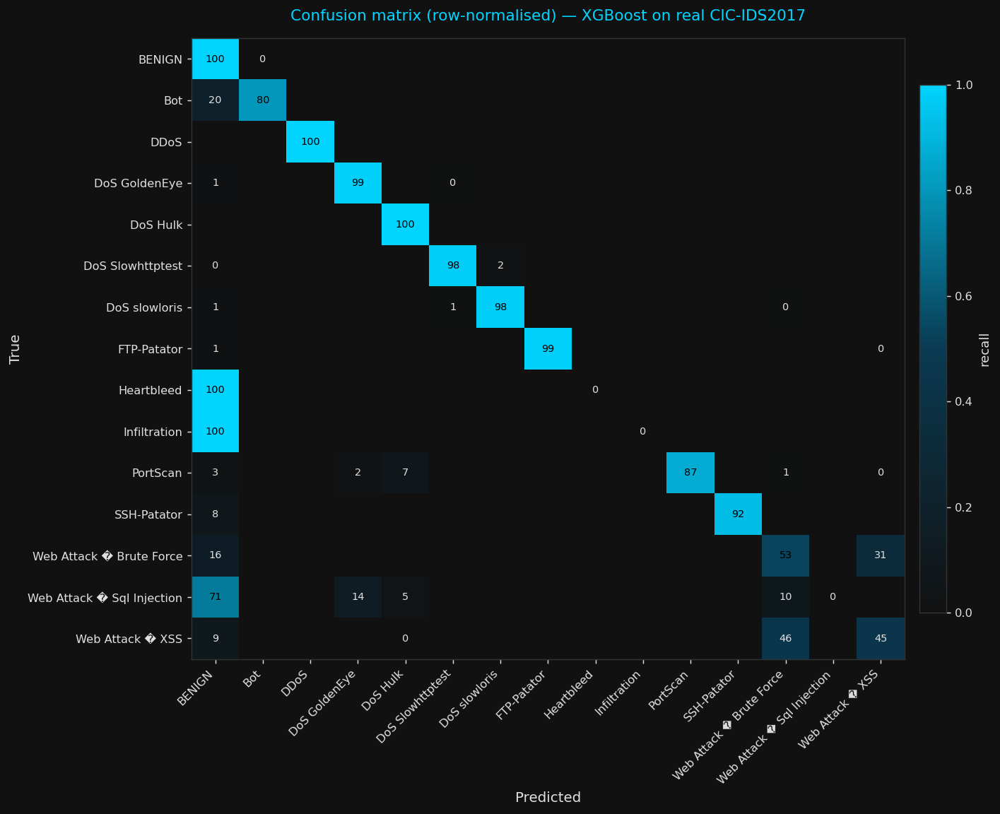

<p align="center">
  <h1 align="center">ThreatLens</h1>
  <p align="center">
    <strong>AI-Powered Threat Analysis — Files and Network Traffic</strong>
  </p>
  <p align="center">
    Two modules in one platform:<br>
    <strong>1.</strong> Upload any file &rarr; get a clear explanation of what it does and why it's dangerous.<br>
    <strong>2.</strong> Upload a PCAP capture &rarr; ML-based detection of network intrusions with SHAP explanations.
  </p>
  <p align="center">
    <a href="https://cozy-spontaneity-production-1a38.up.railway.app">Live Demo</a> &bull;
    <a href="#quick-start">Quick Start</a> &bull;
    <a href="#modules">Modules</a> &bull;
    <a href="#network-intrusion-detection">Network IDS</a>
  </p>
</p>

---

ThreatLens combines classical static analysis (YARA, heuristics, PE/Office/script parsing) with a supervised ML pipeline trained on [CIC-IDS2017](https://www.unb.ca/cic/datasets/ids-2017.html) for network flow classification. Every detection is accompanied by a human-readable explanation — either rule-based, generated by YandexGPT, or derived from SHAP feature attributions.

> **Try it now:** [https://cozy-spontaneity-production-1a38.up.railway.app](https://cozy-spontaneity-production-1a38.up.railway.app)

## Modules

| # | Module | Input | Output |
|---|--------|-------|--------|
| 1 | **File Threat Analyzer** | `.exe .dll .py .js .ps1 .docx .zip` ... | Risk score 0&ndash;100, YARA matches, heuristic verdict, AI explanation |
| 2 | **Network Intrusion Detector** | `.pcap .pcapng .cap` | Per-flow label (BENIGN / DoS / PortScan / DDoS / Bot / ...), confidence, SHAP feature attributions |

Both modules share the same FastAPI web UI, YandexGPT integration, SQLite cache and rate limiter.

## Architecture

```
                    +---------------------------------+
                    |   FastAPI web UI + JSON API     |
                    +-----------+---------+-----------+
                                |         |
                +---------------v--+   +--v--------------------+
                | File Analyzer    |   | Network IDS           |
                |------------------|   |-----------------------|
                | YARA (1500+)     |   | cicflowmeter -> 70    |
                | Heuristic engine |   | CIC-IDS2017 features  |
                | PE/OLE/scripts   |   | XGBoost + RF + IForest|
                | SHA256 cache     |   | SHAP explanations     |
                +--------+---------+   +-----------+-----------+
                         |                         |
                         +-----------+-------------+
                                     v
                         +-----------+-----------+
                         | YandexGPT explanation |
                         +-----------------------+
```

## Screenshots

<p align="center">
  
  <br><em>File analysis with threat explanation in human language</em>
</p>

<p align="center">
  
  <br><em>Network IDS &mdash; stacked timeline of benign vs attack flows</em>
</p>

<p align="center">
  
  <br><em>Per-flow SHAP feature attribution (explainable AI &mdash; red pushes toward the predicted class, blue against)</em>
</p>

<p align="center">
  
  
  <br><em>Class distribution and top source IPs (attack/benign split)</em>
</p>

<p align="center">
  
  <br><em>Scan history with risk indicators</em>
</p>

## File Analyzer

- **Static Analysis** &mdash; PE imports, strings, entropy, packer detection
- **Script Analysis** &mdash; Python, JavaScript, PowerShell, Batch, VBScript
- **Office Analysis** &mdash; VBA macros, OLE objects, DDE attacks
- **Archive Analysis** &mdash; ZIP, RAR, 7z, tar.gz &mdash; recursive scan, shows which file inside is dangerous
- **GitHub Repo Scan** &mdash; Scan any public repository for malicious code
- **1500+ YARA Rules** &mdash; Community rules + custom ThreatLens rules
- **Heuristic Engine** &mdash; Behavioral pattern matching for stealer / RAT / ransomware / miner / dropper / keylogger profiles
- **AI Explanations** &mdash; Built-in (no API needed) + optional YandexGPT
- **SHA256 Cache** &mdash; Instant results for previously scanned files

## Network Intrusion Detection

ML-based classifier trained on CIC-IDS2017 (2.83M flows, 14 attack classes).

### Pipeline

```
PCAP file  ->  cicflowmeter  ->  70 CIC-IDS2017 features  ->  ML models
                                                                  |
                                                          +-------+--------+
                                                          |                |
                                                   XGBoost / RF     Isolation Forest
                                                   (multiclass)     (unsupervised 0-day)
                                                          |                |
                                                          v                v
                                                    predicted class    anomaly score
                                                          |
                                                          v
                                       +------------------+--------------------+
                                       |                                       |
                                       v                                       v
                              SHAP explanation                  YandexGPT explanation
                              (top features)                    (natural language, RU)
```

### Models & metrics (50K stratified sample, train/test 80/20)

| Model | Accuracy | Precision | Recall | F1 | Train time |
|-------|---------:|----------:|-------:|---:|-----------:|
| Random Forest | 0.9975 | 0.9976 | 0.9975 | 0.9975 | 0.88 s |
| **XGBoost (default)** | **0.9983** | **0.9983** | **0.9983** | **0.9983** | 5.30 s |
| Isolation Forest (benign-only) | &mdash; | &mdash; | &mdash; | 0.413 | &mdash; |

Top predictive features: `Idle Mean`, `Bwd Packet Length Std`, `act_data_pkt_fwd`, `Average Packet Size`, `Bwd Packet Length Mean`.

<p align="center">
  
  
  <br><em>Top-20 features by XGBoost gain &mdash; row-normalised confusion matrix on a balanced CIC-IDS2017 slice</em>
</p>

### Attack classes

`BENIGN` | `DoS Hulk` | `DoS GoldenEye` | `DoS slowloris` | `DoS Slowhttptest` | `Heartbleed` | `DDoS` | `PortScan` | `FTP-Patator` | `SSH-Patator` | `Web Attack &ndash; Brute Force` | `Web Attack &ndash; XSS` | `Web Attack &ndash; Sql Injection` | `Bot` | `Infiltration`

### Known limitation &mdash; feature drift

CIC-IDS2017 was produced with the original Java CICFlowMeter; we use the `cicflowmeter` Python port, which is behaviourally close but not bit-identical (notably flag counting). Predictions on third-party PCAPs therefore will not match the 99.8% F1 reported on the CIC-IDS2017 test split. See [threatlens/network/README.md](threatlens/network/README.md) for full details and remediation paths.

### Reproducing results

```bash
# 1. Download CIC-IDS2017 (843 MB) to data/cicids2017/
# 2. Install Python deps
pip install -r requirements.txt
# 3. Train (takes ~10 seconds on 50K sample)
python -m threatlens.ml.train --data-dir data/cicids2017 --sample-size 50000
# -> artefacts written to results/cicids2017/
#    feature_pipeline.joblib, random_forest.joblib, xgboost.joblib,
#    isolation_forest.joblib, metrics.json, comparison.csv
```

All models use fixed `random_state=42`.

## Quick Start

### Web UI

```bash
git clone https://github.com/MaximkaVLG/threatlens.git
cd threatlens
pip install -r requirements.txt
python -m threatlens.web.app
# Open http://localhost:8888
# File tab: upload .exe, .zip, .docx, ...
# Network tab: upload .pcap, see flow classification + SHAP charts
```

### CLI (file module only)

```bash
threatlens scan suspicious.exe
threatlens scan cheat_pack.zip
threatlens repo https://github.com/user/suspicious-project
threatlens lookup abc123def456...
threatlens stats
```

### Docker

```bash
docker-compose up
# Open http://localhost:8888
```

## API

```bash
# File scan
curl -X POST http://localhost:8888/api/scan -F "file=@suspicious.exe"

# PCAP analysis
curl -X POST http://localhost:8888/api/network/analyze-pcap \
     -F "file=@capture.pcap" -F "model=xgboost" -F "max_flows=200"

# Per-flow SHAP explanation
curl -X POST http://localhost:8888/api/network/explain-flow-shap \
     -H "Content-Type: application/json" \
     -d '{"flow": {...flow dict from analyze-pcap...}, "top_k": 10}'

# Per-flow YandexGPT explanation (requires YANDEX_OAUTH_TOKEN)
curl -X POST http://localhost:8888/api/network/explain-flow \
     -H "Content-Type: application/json" \
     -d '{"flow": {...}}'

# Hash lookup, scan history, stats
curl http://localhost:8888/api/lookup/abc123...
curl http://localhost:8888/api/history
curl http://localhost:8888/api/stats
```

## Project layout

```
threatlens/
  analyzers/      static parsers (PE, OLE, scripts, archives)
  rules/          YARA signatures (custom + community)
  scoring/        risk aggregator
  heuristics/     behavioural pattern detection
  ml/             CIC-IDS2017 training pipeline + SHAP explainer
      dataset.py  CSV loader, 78 features + labels
      features.py StandardScaler + LabelEncoder + VarianceThreshold
      models.py   RandomForest / XGBoost / IsolationForest factories
      train.py    CLI entry point; produces results/cicids2017/*.joblib
      evaluate.py metrics + feature importances
      shap_explainer.py  per-flow SHAP attribution
  network/        PCAP -> flows -> predictions
      flow_extractor.py  cicflowmeter wrapper -> 70 CIC-IDS2017 columns
      detector.py        loads joblib models, produces per-flow predictions
  ai/             YandexGPT provider + prompts (file + network)
  web/            FastAPI app, templates, static assets
  cache.py        SQLite result cache
tests/            pytest suite (static analyzers + ML + network)
results/cicids2017/  trained artefacts (joblib) + metrics
data/cicids2017/  input CSVs (not in repo; download separately)
docs/screenshots/ UI screenshots
```

## Tech Stack

- **Python 3.10+** (tested on 3.12 in Docker, 3.14 locally)
- **Static analysis:** `pefile`, `yara-python`, `oletools`, `py7zr`, `rarfile`, `pyzipper`
- **ML:** `scikit-learn`, `xgboost`, `cicflowmeter`, `scapy`, `pandas`, `numpy`, `joblib`, `shap`
- **Web:** `FastAPI`, `uvicorn`, Jinja2 templates, vanilla JS, Plotly.js
- **AI:** `httpx` + YandexGPT API (OAuth + IAM token)
- **Persistence:** SQLite for file scan cache
- **Deploy:** Dockerfile + Railway

## License

MIT License &mdash; see [LICENSE](LICENSE) for details.
